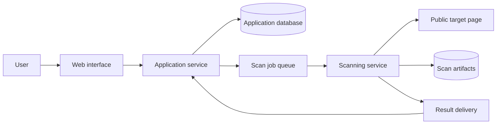

# Page Analyzer

A web application that analyzes a page's performance, technical SEO, accessibility, and web best practices, then turns the findings into a prioritized improvement plan.

**Status:** Project definition and implementation specifications. No application code or runnable services exist yet.

## Documentation

- [Agent instructions](AGENTS.md): working rules for AI coding agents.
- [Integration roadmap](docs/roadmap.md): early feasibility proofs and eight integration stages with detailed features, results, and verification.
- [Implementation tickets](docs/tickets/README.md): 36 work items with early feasibility checks, decision gates, dependencies, and acceptance criteria.
- [Product specification](docs/product.md): user journey and first-version acceptance criteria.
- [Architecture specification](docs/architecture.md): service ownership, scan flow, and trust boundaries.
- [Domain and service contracts](docs/contracts.md): lifecycle, findings, result delivery, and comparison semantics.
- [Implementation notes](docs/implementation.md): open technical decisions and verification criteria.

## Product vision

Help website owners, developers, and small web agencies understand what is wrong with a page, why it matters, and how to improve it. A user submits a URL and receives one report with measured results, supporting evidence, and practical next steps.

The intended value is the path from finding to verified improvement: consolidate overlapping findings, explain their impact, recommend concrete fixes, and compare a later scan against the original. This is a product hypothesis to validate with users, not a claim that the market lacks competing analyzers.

## Intended users

- Developers checking a page before or after a release.
- Small agencies reviewing and maintaining client websites.
- Website owners who need an understandable list of improvements to discuss with a developer.

## Analysis coverage

| Area | Planned analysis | Example recommendation |
| --- | --- | --- |
| Performance | Laboratory loading metrics, layout shifts, blocking resources, image sizes, and JavaScript cost | Resize and compress an oversized hero image; explain the affected resource and measured cost. |
| Technical SEO | Titles, descriptions, canonical URLs, indexing directives, response status, and crawlable links | Correct a conflicting canonical URL or add a missing page title. |
| Accessibility | Automated checks for labels, accessible names, contrast, and document structure; separate manual-review items | Add an accessible name to an icon-only button and identify the affected element. |
| Web best practices | HTTPS usage, mixed content, and browser-reported problems | Replace a specific insecure resource URL and verify it in a new scan. |

Future coverage may include multi-page broken-link analysis, structured data, responsive layout checks, content structure, and real-user performance data where available.

## First version

1. Submit one publicly reachable HTTP or HTTPS page and select a mobile or desktop scan profile.
2. Create a background scan and display its queued, running, completed, partially completed, or failed state.
3. Run the initial performance, technical SEO, accessibility, and best-practice checks.
4. Present category results and a consolidated, prioritized list of findings.
5. Explain each finding with evidence, why it matters, a suggested fix, and a verification step.
6. Retain the report and allow a new scan of the same page to show resolved, persistent, and new findings.

The first version is complete when a user can submit a public page, receive an actionable report, and compare a subsequent scan without an operator manually running tools.

### Report contents

- Requested and final URL, scan time, device profile, engine versions, and scan conditions.
- Category scores where supplied by an engine, with their source and limitations.
- Findings grouped by category, with duplicates combined while retaining their sources.
- Severity and estimated effort, with a short explanation of the priority.
- Affected elements or resource URLs, measured values, and relevant evidence.
- Suggested fixes, supporting documentation, and instructions for checking the result.
- Failed or skipped checks and items that require human review.

Keep category results distinct. Do not hide important failures behind an unexplained combined score. Effort and expected benefit are estimates, not guarantees.

## Proposed microservices architecture

Use one repository with two independently deployable backend services and a web interface. Keep analysis categories as modules within the scanning service initially.

| Component | Responsibility |
| --- | --- |
| Web interface | URL submission, scan progress, reports, and comparisons. |
| Application service | Validate requests, manage scan lifecycle and report access, persist normalized findings, and compare scans. Own the application database. |
| Scanning service | Consume jobs, run isolated browser-based checks, normalize engine output, and deliver findings and artifact references. Scale independently because scans are resource-intensive. |
| Job queue | Buffer work and support bounded retries without blocking web requests. |
| Artifact storage | Retain raw engine reports and supporting evidence with controlled access and retention. |

Each job and result carries a scan ID and contract version. Result processing must be idempotent so retries cannot duplicate findings or overwrite a completed scan with an older attempt. Define the queue technology, result-delivery mechanism, and contracts during implementation; no infrastructure is provisioned yet.

Keep recommendation formatting and rule-based prioritization inside the existing services. Extract additional services only when their workload or deployment needs justify it.

## Analysis engines and implementation direction

Reuse established engines instead of writing a new browser auditing engine. [Lighthouse](https://developer.chrome.com/docs/lighthouse/overview) provides automated performance, accessibility, SEO, and other audits and is the proposed initial foundation.

[axe-core](https://github.com/dequelabs/axe-core) is a possible source for additional accessibility checks when there is a specific coverage need. Avoid running overlapping checks merely to increase the number of tools.

Language, frontend framework, database, queue, and hosting choices remain open. Choose them when implementing the first end-to-end scan. Local service orchestration should remain simple and reproducible.

AI-assisted explanations can be added later. The first version should produce useful guidance from measured findings and curated recommendations. Any future AI output must reference actual findings, distinguish suggestions from observations, and treat scanned page content as untrusted data.

## Scan reliability and boundaries

- Run browsers in isolated environments with strict time, memory, download-size, and concurrency limits.
- Restrict outbound traffic to public destinations. Enforce restrictions for the initial URL, DNS resolution, redirects, and every browser subrequest to prevent access to private networks, local services, and cloud metadata endpoints.
- Use bounded retries and preserve partial results when an individual analysis fails.
- Record scan conditions and engine versions; warn when comparisons use different profiles or versions. Performance measurements can vary between runs.
- Keep reports private by default and avoid retaining sensitive page content or URL credentials. Define deletion and retention behavior before public deployment.
- Add request limits and abuse controls before exposing scanning publicly.

Automated accessibility checks do not establish complete accessibility or legal compliance. Technical SEO checks do not guarantee indexing or rankings. Laboratory performance results must be labeled separately from real-user measurements. Basic web checks are not a penetration test.

## Later milestones

1. **Site coverage:** bounded same-site crawling, grouped findings across pages, and shared-template issue detection.
2. **Continuous monitoring:** scheduled scans, regression notifications, history, and more reliable performance comparisons.
3. **Agency workflow:** projects, team access, client-facing reports, exports, and task-tracker integrations.
4. **Deeper guidance:** optional framework-specific recommendations and AI-assisted explanations grounded in scan evidence.

Authenticated pages, automatic website edits, full security testing, and large-scale crawling are outside the first version.

## Validation before expanding

Show a sample report to developers and agencies. Establish whether consolidated prioritization and scan comparisons save time compared with their existing tools. Test willingness to pay for a narrow recurring workflow before adding billing or a broad feature set.

## Repository contents

This repository currently contains the project description, agent instructions, implementation specifications in `docs/`, and a minimal Git ignore file. There are no installation, startup, or test commands until implementation begins.
